# 【产品需求】SaaS v5.3 万能穿搭融合交互优化

飞书文档：[在线阅读](https://lightchain.feishu.cn/wiki/WpiswINzhiJLCxkrmZncdhRenxb)

## 一、版本信息

**产品版本：** v5.3 | **更新时间：** 2026-09-15 | **当前阶段：** 交互评审 | **产品范围：** 万能穿搭融合

| 项目 | 说明 |
| --- | --- |
| 项目名称 | SaaS v5.3 万能穿搭融合交互优化 |
| 需求类型 | 画布导航、关系反馈与提示词管理体验优化 |
| 本期范围 | 画布小地图、整理画布、蚂蚁线、选中框、3%／5% 缩放比例、输入框放大、保存提示词弹窗、提示词库、画布缩放速度，共 9 项。 |
| 当前状态 | 已形成可交互前端 Demo，用于产品与交互评审；本文中的验收标准为交付要求，不代表已完成生产上线验收。 |
| 设计规范 | Lightchain SaaS v5.1 libraries Beta；产品版本为 v5.3，组件库沿用其自身版本。 |
| 数据范围 | 提示词库当前保存在本地浏览器；AI 生成后端、真实生成历史采集与账号云端同步尚未接入。 |

## 二、变更日志

| 时间 | 产品版本 | 变更人 | 主要变更 |
| --- | --- | --- | --- |
| 2026-09-15 | v5.3 | 谢绮媚 | 归纳本轮 9 项交互功能，补齐使用流程、状态规则、边界、验收标准及数据记录需求；统一产品、代码仓库与演示分享入口的版本标识。 |

### 本轮追加：多节点与连接分层整理

- 同一主图可以多次创建独立编辑器，每个节点的提示词、参考图及设置互不覆盖。
- 生成按钮提供本地演示：有效主图和指令齐全时，每次追加一张固定示例图，连接实际编辑器。结果可继续派生编辑器，参与整理及撤销／重做；无 AI 请求、真实任务、扣费或生成历史写入。
- 最终确认采用连接分层：主图 → 同源编辑器列 → 结果列 → 后续编辑器列 → 后续结果列。同源分支纵向展开，深度向右延伸，不设固定层数上限。此前分支网格化的方案已取消。
- 本轮用户已确认整理效果；已补对应关系的几何计算，并用当前本地 Demo 重新截取整理前后画面。详细规则以 [画布整理与适应屏幕](canvas-layout-and-fit.md) 为准。

## 三、需求背景

万能穿搭融合围绕图片和编辑节点开展创作。随着画布内容增加，用户需要在局部编辑与全局浏览之间反复切换，辨认主图、编辑节点及抠图结果之间的关系，并整理分散的素材。提示词较长或需要重复使用时，也需要更大的编辑空间和可管理的提示词记录。

本期围绕上述操作补齐导航、排版、关系反馈及提示词复用能力：用户可以通过小地图和低倍率定位内容，通过整理画布恢复清晰布局，通过选中框和蚂蚁线识别当前操作对象，并在放大编辑器与提示词库之间连续完成编辑、保存和应用。

本期目标是减少画布定位、内容整理和提示词重复输入的操作成本，并统一交互状态与动效。具体改善幅度需在接入数据记录后评估，本稿不预设已验证的效率或转化提升。

## 四、产品流程

### （一）画布浏览与整理

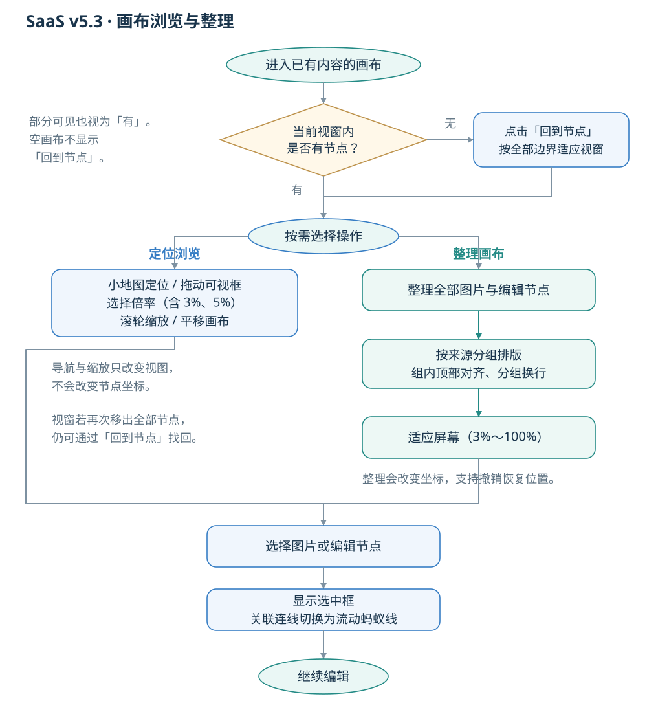

### （二）提示词编辑与复用

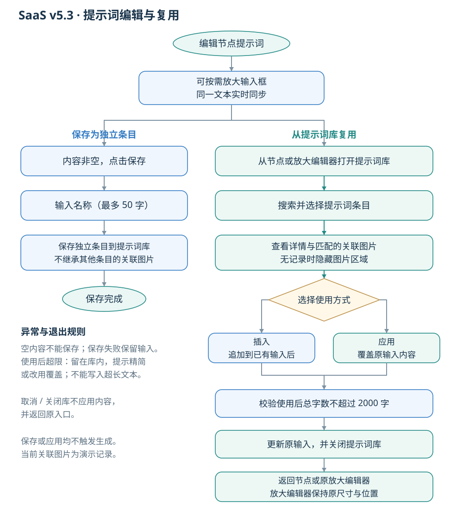

**流程说明**

- 从放大编辑器打开提示词库时，编辑器保留；关闭或应用仅退出提示词库。
- 小地图和缩放只改变视图；整理会改变节点位置，可撤销。全部节点不可见时，可点击「回到节点」定位内容。
- 保存时内容和名称均不能为空，名称最多 50 字；保存失败保留输入。
- 插入或覆盖后总字数最多 2000 字；超限留在库内，提示精简或改用覆盖。取消／关闭不应用内容。
- 提示词保存与应用不触发 AI 生成；当前关联图片为演示记录。

## 五、原型图&UI

原型按下方需求表逐项链接至对应 Figma 节点；可交互演示用于查看连续操作与动效。尺寸、色彩和图标沿用 v5.1 Beta 组件库，局部修正保持周边布局一致。

| 入口 | 链接 |
| --- | --- |
| 交互演示 | [打开 SaaS v5.3 Demo](https://emeiiixxx.github.io/lightchain-saas-v5.3/) |
| 设计稿 | [万能穿搭融合设计稿](https://www.figma.com/design/lDDzsXpslev95eZ1ZpAHVt) |
| 组件库 | [Lightchain SaaS v5.1 libraries Beta](https://www.figma.com/design/FO7bCfBv6NPle8egsVaDvG) |
| 代码仓库 | [lightchain-saas-v5.3](https://github.com/emeiiixxx/lightchain-saas-v5.3) |

> 当前 Demo 的关联图片为演示记录；AI 生成、真实历史采集及云端提示词同步未接入。本文保留这些边界，避免将演示内容视为生产数据。

## 六、需求详细说明

| 模块 | 功能详细说明 | 原型说明 |
| --- | --- | --- |
| 1. 画布小地图 | 1. 入口位于右下工具组；点击独立开关展开／收起，小地图在按钮正上方居中显示，窄屏随工具组避让。 2. 按图片和编辑节点的真实位置与尺寸等比投影，用中性灰色显示轮廓，保留长宽比、间距及重叠关系。灰色可视框对应真实画布视窗。 3. 拖动可视框平移画布，并保留抓取偏移；点击框外将视窗移至点击位置，可继续拖动。导航过程中倍率保持不变。 4. 拖动期间固定小地图投影，画布实时跟手；松手／取消后恢复正常更新。方向键每次按对应方向移动可视区域尺寸的 10%。 5. 平移、缩放、节点移动和窗口尺寸变化时同步更新。小地图与网格吸附为独立开关，可同时开启。 6. 有内容但视窗与全部节点无交集时，显示“当前视窗没有节点，可点击按钮快速回到内容区域”和“回到节点”；点击按全部内容适应。空画布或任一节点部分可见时隐藏提示。 | [画布工具布局](https://www.figma.com/design/lDDzsXpslev95eZ1ZpAHVt?node-id=57-25504)；小地图行为以灰色等比概览规则为准。  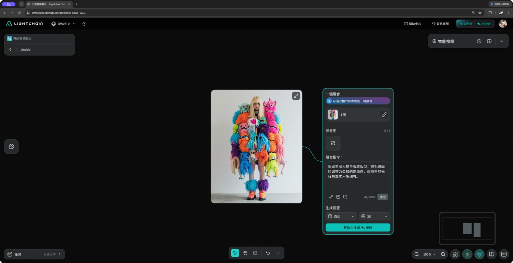 画布小地图：真实节点分布与可视范围 |
| 2. 整理画布 | 1. 点击后整理全部图片与编辑节点，包含视窗外内容和空编辑节点，不局限当前选区。 2. 按现存来源关系，将原图、各级抠图结果和对应编辑节点放在同一关联组；不存在的来源不补建关系。 3. 关联组在左，无来源关系且无编辑节点的独立图片在右；两区间距 240，仅有一个区时不预留空区。 4. 组内按真实连接分层：同源编辑器同列上下排列，结果进入下一层，后续步骤继续向右。每层按最大节点宽度预留，列边界间距 80；父节点与后代区域垂直居中，子分支、组间及换行间距 120。以上间距均按画布坐标计算。 5. 仅对不同关联组和独立图片区按可用显示区域选择列数；组内层数由真实连接深度决定，不将并列分支排成前后步骤。相同输入与窗口尺寸产生一致布局；保持图片尺寸、配置、关系和选中状态。整理不创建永久分组，也不套用拖拽网格吸附。 6. 完成后适应全部内容，适应倍率 3%～100%，预留固定工具栏空间；最低 3% 仍装不下时居中显示，不继续缩小。 7. 整理记录一次撤销／重做，可恢复节点位置；视图变化不计入内容历史。拉伸窗口保持倍率与中心画布位置，不自动重排。 | [整理入口](https://www.figma.com/design/lDDzsXpslev95eZ1ZpAHVt?node-id=57-25504)；完整布局边界见仓库 docs/canvas-layout-and-fit.md。  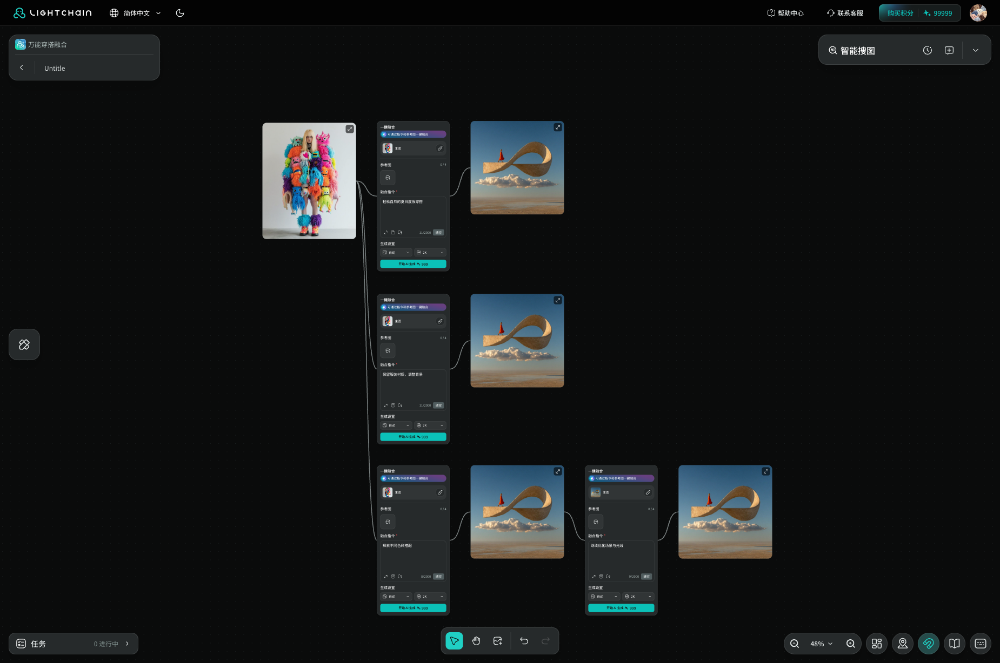 整理前：同源编辑器、结果与后续分支  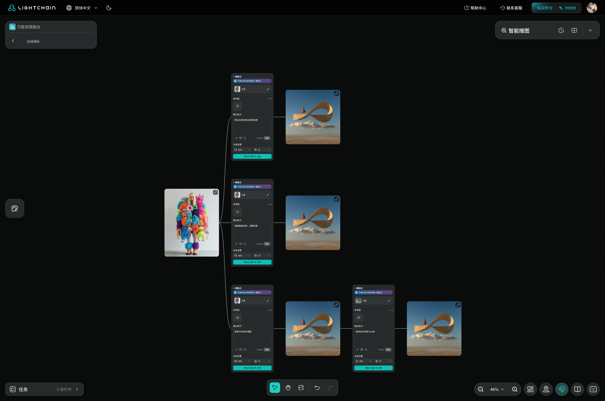 整理后：同源编辑器同列，结果与后续步骤按层向右 |
| 3. 蚂蚁线 | 1. 适用于主图与编辑节点、原图与抠图结果的有效连接关系。 2. 任意一端选中时显示主题色流动虚线；两端均未选中时恢复灰色实线。 3. 流动周期 800ms，linear 连续循环；选中颜色切换 200ms ease-out；系统减少动态效果时停止流动。 4. 高亮连线显示在画布图片和节点内容前方；取消两端选择后恢复底层。不覆盖固定工具栏或弹窗，不拦截点击、拖动及表单操作。 5. 拖动任一端时跟随真实边界。选择连接多个编辑节点的主图，高亮全部直接连线；选择其中一个编辑节点，只高亮其自身连线。 6. 任一端删除后隐藏对应连线；撤销恢复有效关系后重新显示。抠图来源通过明确记录建立，不按名称猜测。 | [融合节点关系](https://www.figma.com/design/lDDzsXpslev95eZ1ZpAHVt?node-id=35-6422)  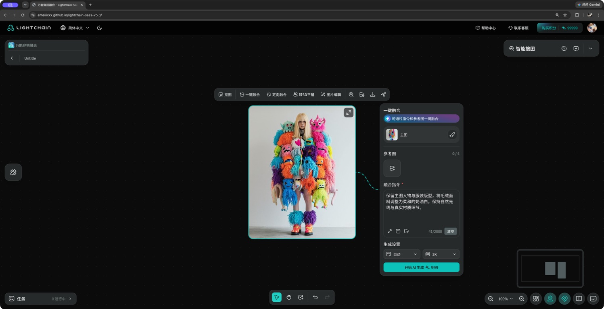 选中主图：关联连线显示高亮蚂蚁线 |
| 4. 选中框 | 1. 单张图片显示自身选中描边及单图工具栏；多张图片使用联合边界蓝色虚线框、20% 蓝色蒙版和多图工具栏。 2. 单个编辑节点显示自身描边；图片与编辑节点混选或选中多个编辑节点时，使用全部选中元素的联合边界与蒙版，不显示图片工具栏。 3. 图片与编辑节点自身描边按画布坐标 2px 绘制，随倍率自然缩放：50% 显示 1px，200% 显示 4px；图片圆角 16px。 4. 选中描边不拦截操作；节点选中时隐藏原弱描边，避免叠边。图片工具栏位于选区上方 16px并随视图更新。 5. 选择工具支持空白框选、Shift 多选与整组拖动；整组使用同一位移，保持相对位置。抓手或按住空格平移画布。 6. 批量上传后选中本批图片；撤销／重做恢复内容与选区。 | [单图选中](https://www.figma.com/design/lDDzsXpslev95eZ1ZpAHVt?node-id=57-25504)；[多图选中](https://www.figma.com/design/lDDzsXpslev95eZ1ZpAHVt?node-id=57-24422)   单图选中：自身描边与图片工具栏  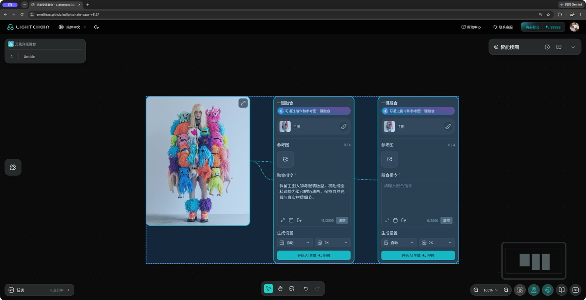 混合选区：图片与编辑节点联合边界及蒙版 |
| 5. 新增 3%／5% 缩放比例 | 1. 固定倍率菜单依次为 200%、100%、50%、30%、10%、5%、3%，最后一项为“适应屏幕”。 2. 手动缩放范围 3%～400%；适应屏幕为 3%～100%。勾选跟随实际倍率，不固定停留在上一次选择项。 3. 选择固定倍率以视窗中心为锚点；只调整视图，不修改图片及节点位置。 4. 缩放控件 144×40；菜单 112×300、内边距 8、条目高 32、间距 4，在控件上方 4px 居中展开。 5. 百分比框聚焦／展开显示组件规定的填充及品牌描边；选项使用主题文字和原始勾号。箭头跟随展开状态；点击外部或 Escape 关闭。 | [缩放菜单](https://www.figma.com/design/lDDzsXpslev95eZ1ZpAHVt?node-id=57-27017)   新增 5% 档位：查看更大画布范围  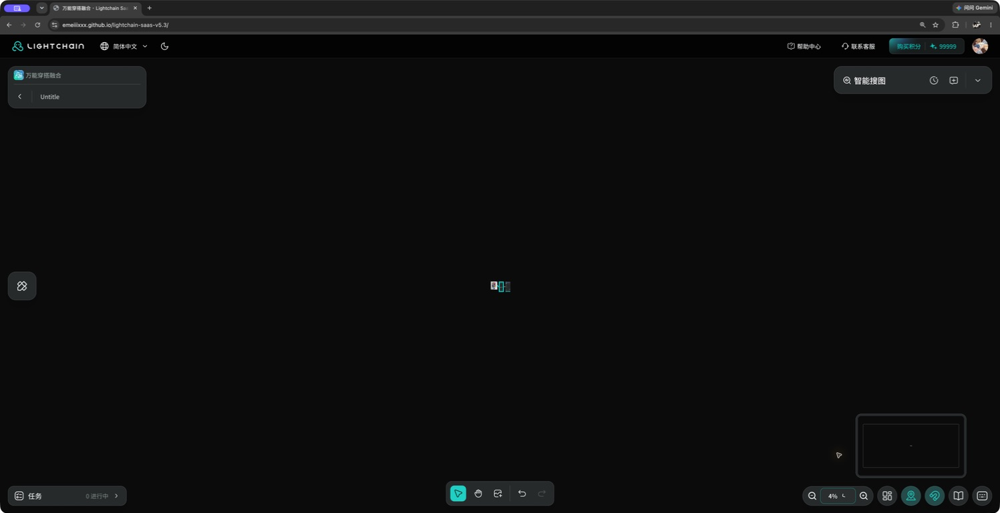 新增 3% 档位：最低缩放比例的实际显示 |
| 6. 输入框放大 | 1. 点击节点提示词放大入口，打开默认 960×640 输入区，背景使用遮罩和 50px 模糊。 2. 支持四角实时拉伸，最大输入区 1280×720；尺寸与位置受当前视窗限制，避免超出屏幕。 3. 提示词最多 2000 字；编辑实时同步原节点。Escape、空白背景或收起按钮退出后保留文本。 4. 放大编辑器内可保存提示词或打开提示词库。打开库时保留编辑器文本、尺寸和位置；关闭／应用后返回编辑器。 5. 输入、拉伸与弹层内操作不触发画布拖动或平移。 | [放大编辑器](https://www.figma.com/design/lDDzsXpslev95eZ1ZpAHVt?node-id=36-8218)  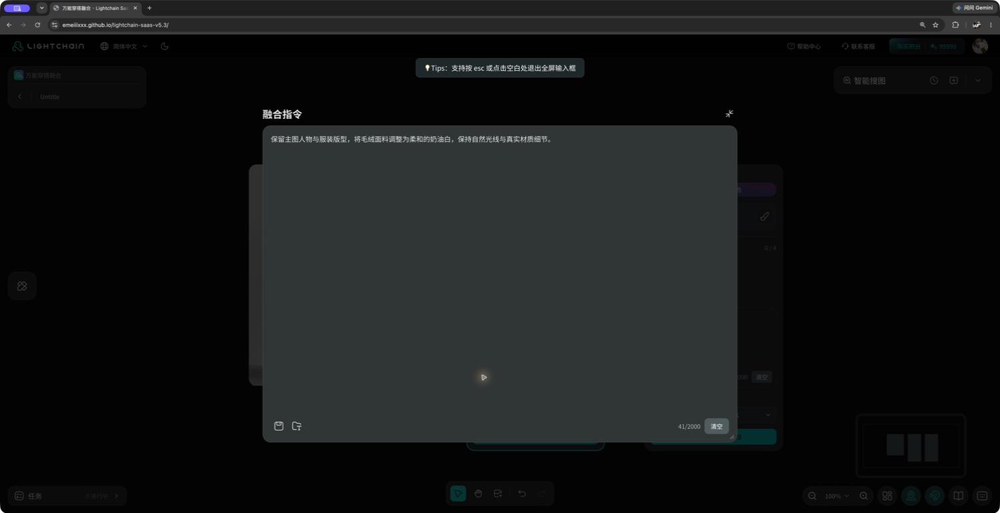 放大提示词输入区：实时同步节点内容 |
| 7. 保存提示词弹窗样式优化 | 1. 点击保存后先命名：使用宽 280、内边距 16、主要内容间距 16 的气泡，包含标题、关闭、名称输入和取消／保存。 2. 气泡优先在触发按钮上方展开，空间不足时下移，并避让视窗边缘；从放大编辑器打开也保持顶层可见。 3. 提示词为空时提示“请输入提示词后再保存”。名称必填，最多 50 字并显示计数，纯空白名称不可保存。 4. 有效名称下点击保存或按 Enter 保存。取消、关闭、点击外部或 Escape 退出，不新增记录。 5. 每次保存创建独立条目；相同文本可另存，但不继承其他条目的关联图片。成功后关闭并更新库；本地存储失败时提示失败，保留当前输入。 6. 图标按钮保持正方形和统一 Tooltip；鼠标操作不出现额外键盘焦点圈，Tab 导航保留焦点反馈。 | [保存气泡](https://www.figma.com/design/lDDzsXpslev95eZ1ZpAHVt?node-id=38-14912)  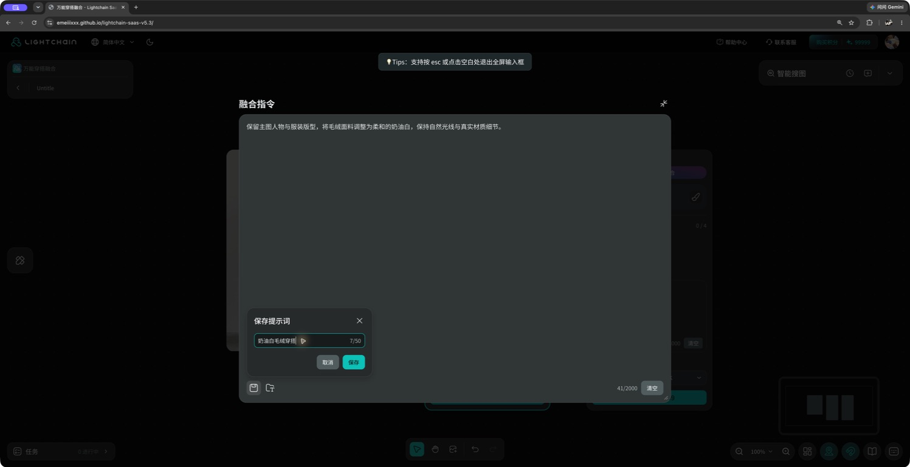 保存提示词：命名气泡与字数计数 |
| 8. 提示词库 | 1. 标准尺寸 1280×800，左侧 320px 列表与搜索，右侧详情／编辑／应用；支持按名称及内容关键词搜索。无记录显示空状态，无搜索结果显示无匹配反馈。 2. 新增时创建列表顶部临时卡片并立即选中，清空搜索、滚动至顶部；空名称／内容使用占位提示，不将占位文字保存。草稿输入实时更新卡片预览。 3. 名称与内容必填，上限 50／2000 字并计数；保存沿用草稿 ID，不重复创建。取消或删除未保存草稿时移除草稿并恢复此前选择。 4. 已保存条目支持编辑、删除；删除后选取可用条目并保持库打开，不删除画布图片。卡片更多菜单支持置顶／取消置顶和删除；置顶优先、最近置顶在前，状态本地保存。 5. 详情底部提供“在已有输入后插入”和“应用并覆盖原文”。插入以换行连接；合并超过 2000 字时阻止并提示精简或覆盖。应用成功后更新原输入并关闭库。 6. 从放大编辑器打开库，退出只返回编辑器；从节点直接打开则返回画布。 7. 关联图片为 144×144、间距 8，右上角 24px 高主图／AI生成标记；有图时提示词区 280px，图库独立滚动。无匹配记录或进入编辑状态时不显示图库。 8. 关联图片必须同时匹配条目身份及生成时完整文本；修改内容使旧快照失配。另存相同文本也不继承旧图，原条目保留其匹配记录。 9. 当前在本地浏览器保存并供节点共享，兼容旧记录；已删除演示条目不会刷新后重新出现，包括全部删空。三组关联图为演示素材，真实生成历史采集尚未接入。 | [提示词库](https://www.figma.com/design/lDDzsXpslev95eZ1ZpAHVt?node-id=42-18476)；[关联图片](https://www.figma.com/design/lDDzsXpslev95eZ1ZpAHVt?node-id=107-5135)；[新增卡片](https://www.figma.com/design/lDDzsXpslev95eZ1ZpAHVt?node-id=43-19100)；[详情卡片](https://www.figma.com/design/lDDzsXpslev95eZ1ZpAHVt?node-id=111-5494)  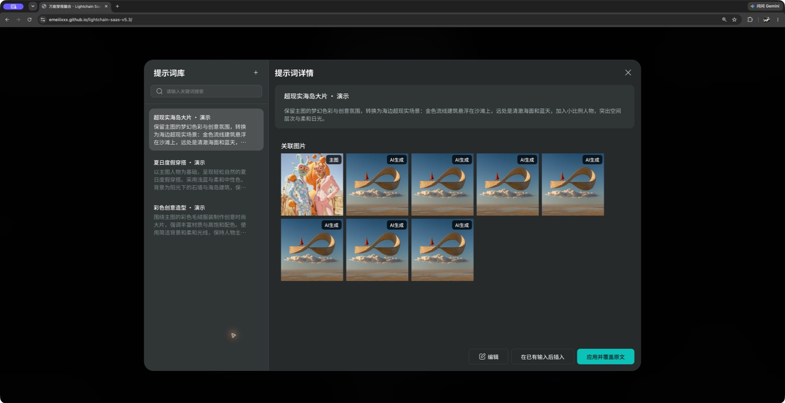 提示词库：详情、关联图片与插入／覆盖操作  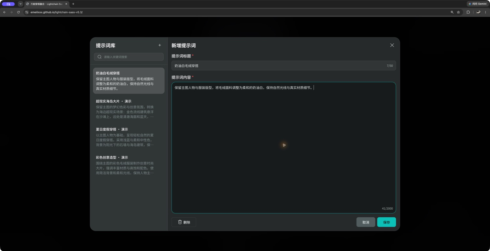 新增提示词：临时卡片与表单实时同步 |
| 9. 缩放画布速度 | 1. Ctrl／Command＋滚轮，以及浏览器映射为 Ctrl 滚轮的捏合手势，围绕指针实时缩放；普通滚轮／触控板滚动按位移平移画布。 2. 选择固定倍率时统一使用 200ms ease-out。连续选择从当前显示倍率继续，不跳回上一轮起点。 3. 过渡期间发生滚轮、平移或小地图导航时，立即取消未完成过渡并响应当前操作。直接拖动和平移不附加缓动。 4. 图片、编辑节点、点阵、选中框和小地图同步更新，不能出现图层追赶或选区滞后。点阵的点大小与间距随倍率一起缩放。 5. 当前滚轮灵敏度系数为 0.005，按输入量连续变化；相同滚轮输入改变相同比例，并统一限制在 3%～400%。实现参数记录于仓库功能规则文档。 6. 系统开启减少动态效果时，固定倍率立即到达目标；仍保留准确的缩放锚点和图层同步。 | [缩放入口](https://www.figma.com/design/lDDzsXpslev95eZ1ZpAHVt?node-id=57-27017)；连续变化参考交互 Demo。  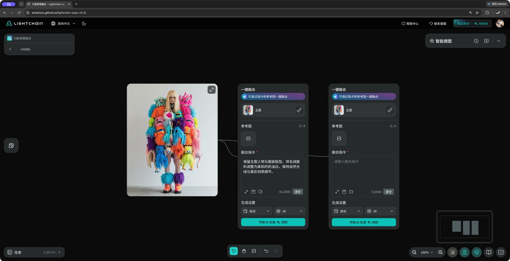 固定倍率切换前：100% 画布  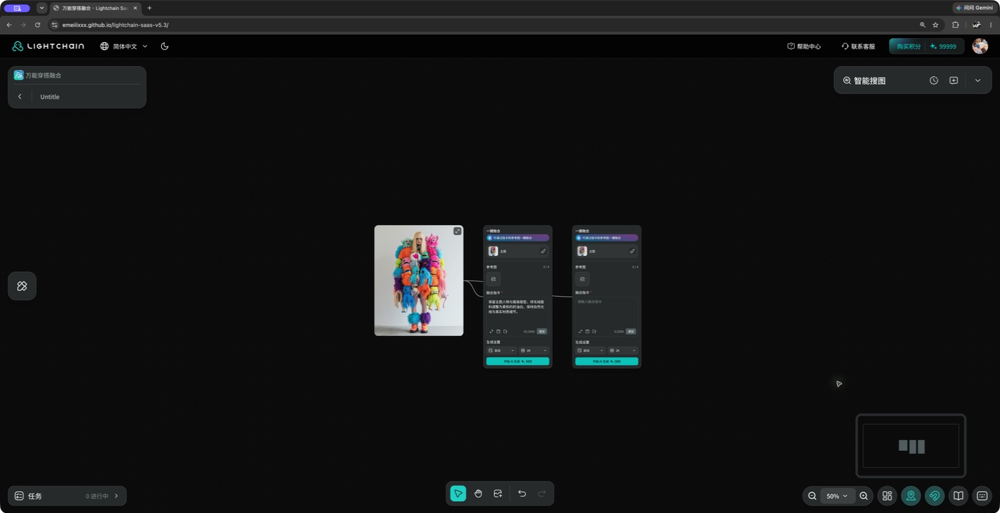 固定倍率切换后：50% 画布；静态截图不表示动效速度 |

### 共用交互规则

- 深浅主题均遵循组件库语义颜色；图标使用原始资源，纯图标按钮使用统一 Tooltip。
- 普通状态变化和弹层进出使用 200ms ease-out，退出完成后卸载。直接操作实时跟随，蚂蚁线流动为单独的 800ms linear 循环。
- 输入、菜单、弹窗和快捷键需隔离画布操作；Tab／Shift+Tab 导航显示焦点反馈，输入框保留组件自身编辑状态。

## 七、验收标准

以下为本期交付验收要求，后续应按场景验收。本次已在浏览器操作 Demo 并截取功能状态图，未执行完整验收或动效逐帧验证。

| 验收项 | 验收标准 |
| --- | --- |
| 小地图 | 不同长宽比、重叠、远离视窗的图片和编辑节点均按真实关系投影；拖动／框外点击／方向键能导航，倍率不变，拖动不漂移。 |
| 回到节点 | 只有有节点且全部不可见时显示提示；部分可见与空画布不显示；点击能按全部内容适应。 |
| 整理画布 | 全部内容参与；同源编辑器同列、结果及后续步骤按层向右；列边界间隔 80，分支／组间 120，两区 240；不同宽高图片保持同层对齐。 |
| 整理恢复与适应 | 整理不改变内容、配置、连接或选中状态；撤销／重做恢复位置；适应不超过 100%、不低于 3%；窗口变化不自动重排。 |
| 蚂蚁线 | 任一端选中即高亮流动，两端取消后恢复灰线；移动、删除、撤销同步关系；高亮层级正确且不拦截操作。 |
| 选中框 | 单图、多图、单节点、多个节点及混合选区均对应正确边界与工具栏；自身描边在 50%／200% 下分别为 1px／4px。 |
| 3%／5% | 菜单顺序、真实倍率勾选及 3% 下限准确；切换后内容坐标不变、中心锚点稳定。 |
| 放大输入 | 四角可拉伸且受视窗限制；文本实时同步；三种退出方式保留文本；嵌套提示词库返回后尺寸和位置保留。 |
| 命名保存 | 空提示词及空白名称阻止保存；50 字上限和计数正确；成功新增独立条目；取消不写入，失败不清空输入。 |
| 提示词管理 | 新增草稿即时出现、预览同步；有效保存不重复；编辑／删除／置顶生效并持久化；删除全部后刷新不重新补演示条目。 |
| 提示词应用 | 插入和覆盖效果明确；超过 2000 字阻止应用；从编辑器及节点两种入口返回正确。 |
| 关联图片 | 仅身份和完整快照同时匹配时显示；修改内容和相同文本另存均不继承旧图；原记录保留图片；无记录时无图库占位。 |
| 缩放速度 | 固定倍率 200ms ease-out；连续选择平滑衔接；直接操作可中断；图片、点阵、节点、选区和小地图同步。 |
| 主题与键盘 | 深浅主题状态正确；Tab 可见焦点、Escape 正确关闭当前层；减少动态效果设置生效。 |

## 八、数据记录

以下为本期建议纳入研发评审的数据记录需求，当前前端 Demo 尚未接入埋点。先记录使用行为与完成结果，再评估效率；不将点击次数直接等同于效果提升。

| 事件 | 触发条件 | 记录信息 | 统计目的 |
| --- | --- | --- | --- |
| 小地图开关 | 用户主动展开／收起时 | 画布会话、开关状态、节点数量、倍率 | 了解概览使用情况 |
| 小地图导航完成 | 点击定位、一次拖动结束或方向键导航时 | 导航方式、节点数量、操作前后视窗是否有内容 | 了解导航使用与返回内容的情况 |
| 整理画布结果 | 一次整理完成或失败时 | 节点数、关联组数、结果、耗时、完成倍率 | 统计整理使用量与完成率 |
| 回到节点 | 提示显示时及用户点击时分别记录 | 同次无内容提示周期、触发来源、点击后内容是否可见 | 判断迷失场景与返回操作效果 |
| 缩放操作完成 | 固定倍率选择完成，或一段连续滚轮缩放结束时 | 操作来源、起止倍率、是否选用 3%／5%、是否被中断 | 观察低倍率使用及缩放交互 |
| 放大编辑器 | 打开／关闭时 | 入口、编辑时长、是否调整尺寸、内容长度 | 观察长提示词编辑需求 |
| 提示词保存结果 | 保存命名或库内新增／编辑完成时 | 操作类型、条目 ID、名称长度、内容长度、成功／失败及原因 | 观察保存需求与失败情况 |
| 提示词库操作 | 打开、搜索提交／停止输入、置顶或删除时 | 入口、操作类型、条目 ID、搜索结果数量 | 观察查找与管理使用情况 |
| 提示词应用结果 | 点击插入或覆盖后 | 入口、条目 ID、应用方式、前后内容长度、成功／超限阻止 | 区分复用意愿与应用受阻 |

统计口径：整理完成率＝成功完成的整理次数／整理触发次数；提示词应用成功率＝应用成功次数／应用尝试次数；低倍率使用占比＝到达 3% 或 5% 的画布会话数／发生缩放的画布会话数。以上指标用于判断使用与稳定性，不能单独证明效率提升。

记录按一次完整操作归并，不逐帧上报。提示词与搜索只记录长度／结果数量等统计信息，不上传正文、名称、搜索原文、图片内容或图片地址。

## 九、待确认事项

- 正式提示词库的账号归属、云端保存与跨设备同步范围；当前以本地浏览器方案为评审基线。
- 真实生成历史的数据来源与记录时机，以及历史删除后关联图片区的更新方式；当前仅使用演示记录。
- 上线验收安排、数据记录是否纳入本期，以及灰度开放范围与时间。

除上述需后端或上线安排配合的事项外，本文交互规则按当前评审方案执行；如调整，需同步更新产品文档、设计稿与交互 Demo。
