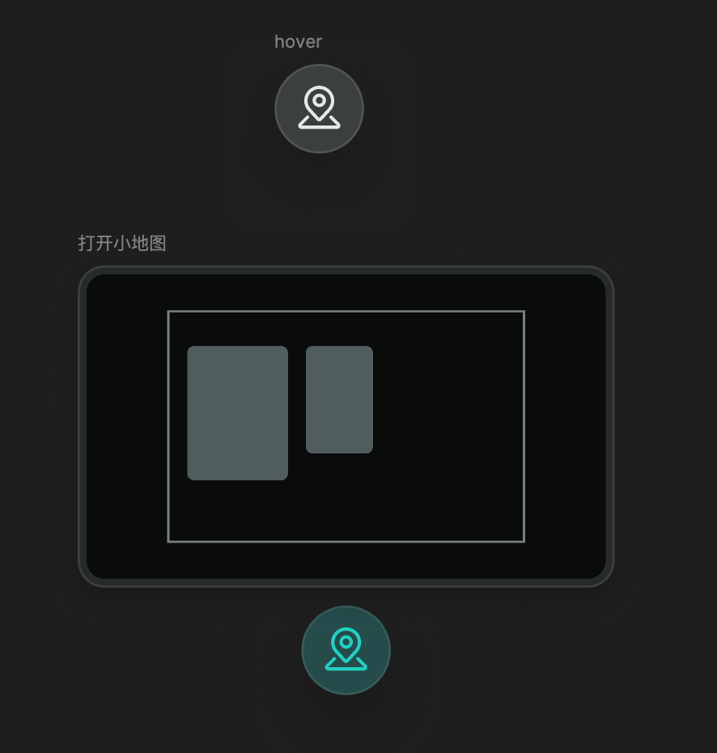
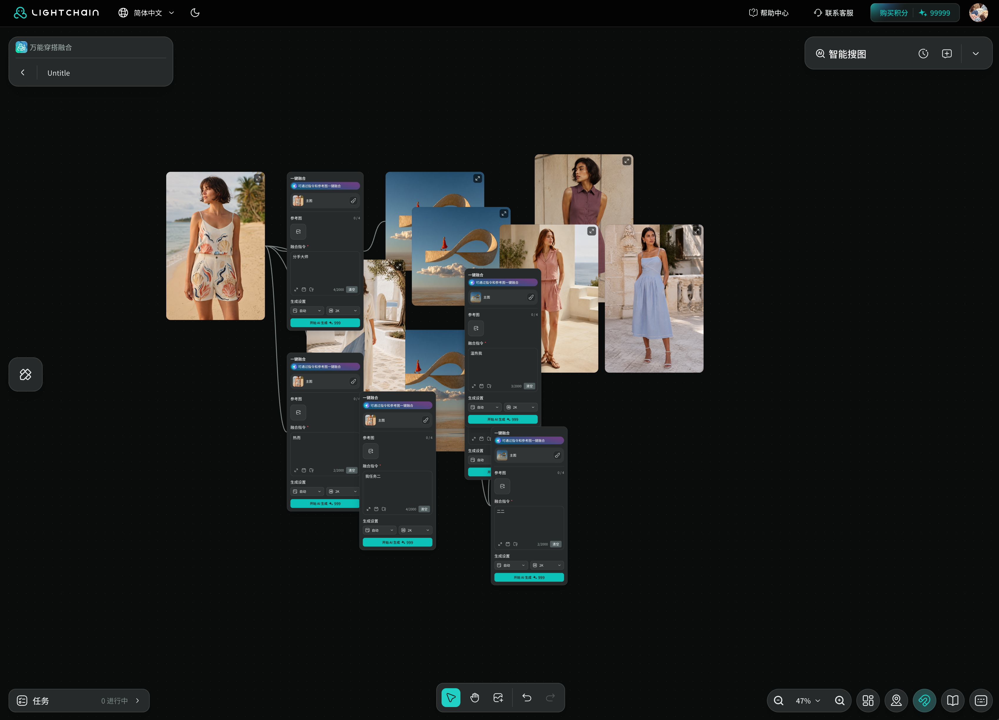
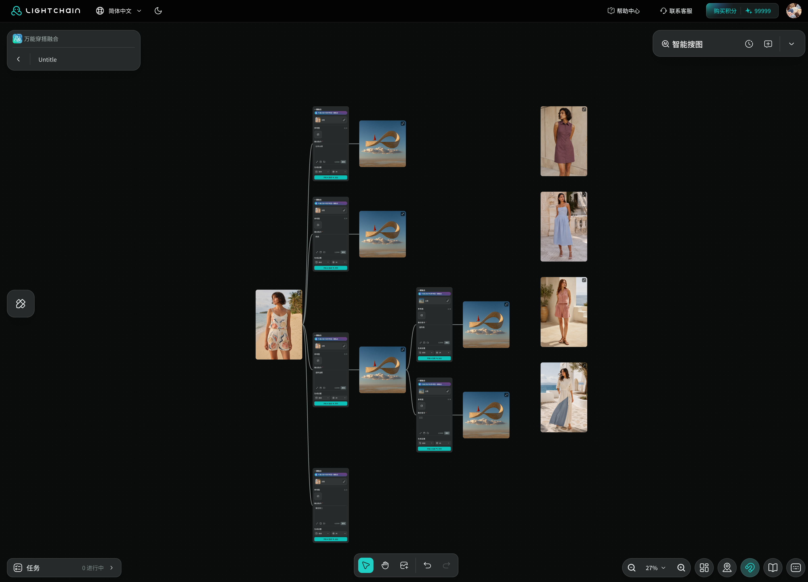
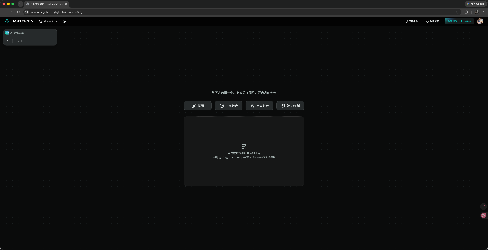
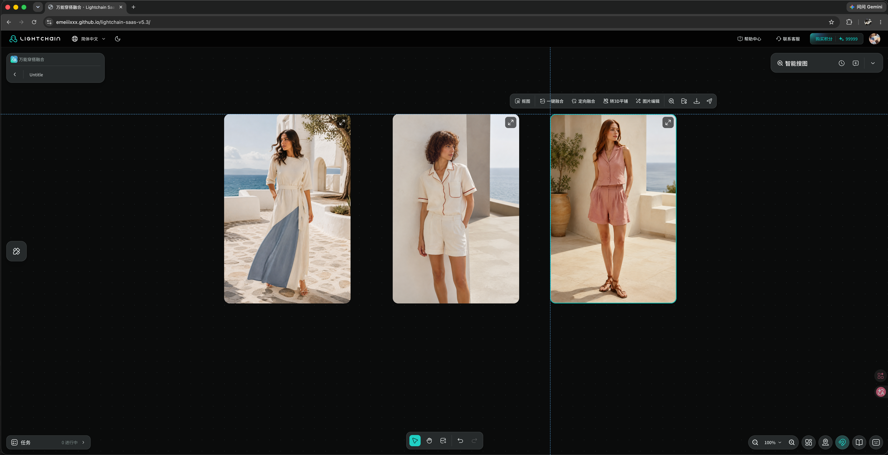
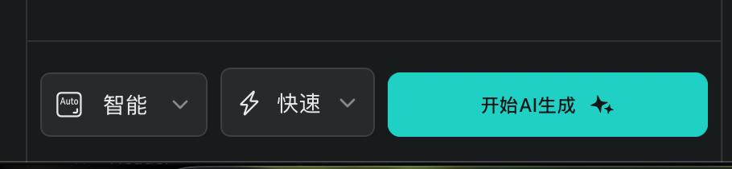
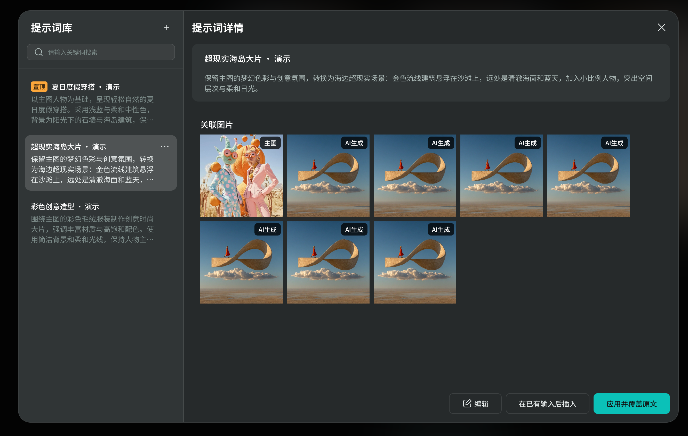
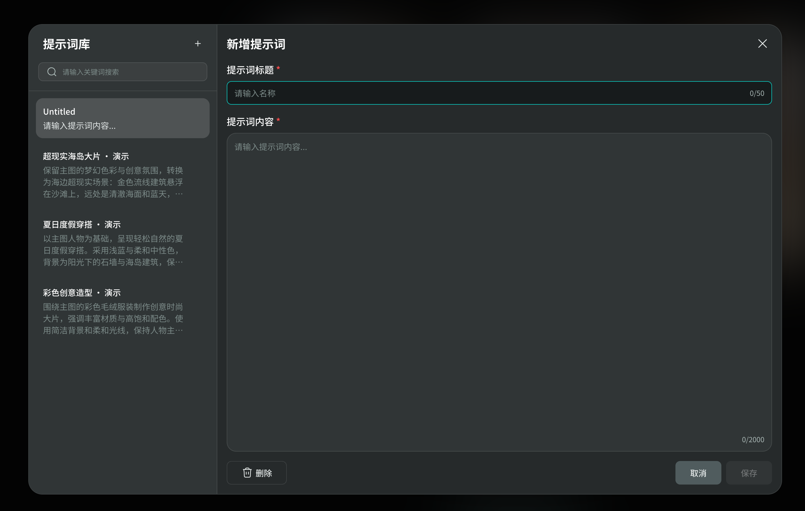
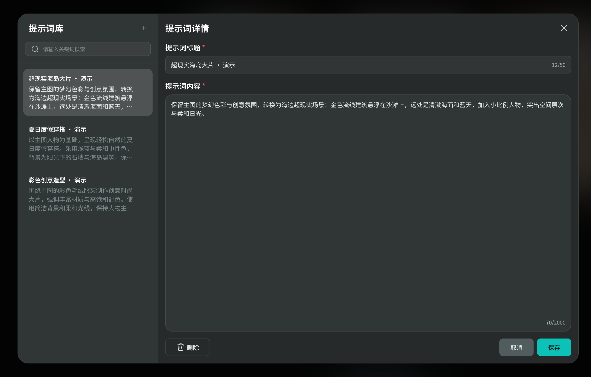

# 【产品需求】SaaS v5.3 万能穿搭融合交互优化

飞书文档：[在线阅读](https://lightchain.feishu.cn/wiki/WpiswINzhiJLCxkrmZncdhRenxb)

## 一、版本信息

**产品版本：** v5.3 | **更新时间：** 2026-09-16 | **当前阶段：** 交互评审 | **产品范围：** 万能穿搭融合、模特企划库局部修复

| 项目 | 说明 |
| --- | --- |
| 项目名称 | SaaS v5.3 万能穿搭融合交互优化 |
| 需求类型 | 画布操作、提示词管理体验优化及模特企划库按钮修复 |
| 本期范围 | **P0**  1. 画布小地图 2. 整理画布 3. 输入框放大优化 4. 蚂蚁线 5. 画布初始化样式优化  **P1**  1. 缩放画布及速度优化 2. 新增 3%／5% 缩放比例 3. 网格吸附开关 4. 指针状态修复 5. 模特企划库底部按钮高度不一致修复  **P2**  1. 选中框优化 2. 保存提示词弹窗样式优化 3. 提示词库 |
| 当前状态 | 已有交互 Demo，供产品评审；尚未完成正式上线验收。 |
| 设计规范 | 产品版本 v5.3；组件库沿用 Lightchain SaaS v5.1 libraries Beta。 |
| 数据范围 | 提示词仅保存在本地浏览器；真实 AI 生成、生成历史和账号云端同步尚未接入。 |

## 二、变更日志

| 时间 | 产品版本 | 变更人 | 主要变更 |
| --- | --- | --- | --- |
| 2026-09-15 | v5.3 | 谢绮媚 | 整理功能的操作、限制、验收和数据要求；产品、仓库及 Demo 链接统一为 v5.3。 |
| 2026-09-16 | v5.3 | 文档校订 | 按 P0／P1／P2 归纳 13 项需求；提示词库确认先纳入 v5.3 的 P2 范围，评审后再按开发评估决定是否顺延。同步整理规则、验收、上传边界与数据建议。 |

## 三、需求背景

**遇到的问题：**画布内容多了，难找位置、难辨认素材关系，也容易排得乱；提示词长了不好编辑，常用内容还要重复输入。

**这次解决什么：**用小地图和低倍率找内容，用整理功能排好位置，用边框和连线看清关系；优化提示词编辑和保存，并统一模特企划库底部按钮高度。提示词库支持常用内容查找和复用，纳入本期 P2。

**目标：**让定位、整理和提示词复用更省操作。具体节省多少时间，需接入数据后验证。

## 四、产品流程

### （一）画布浏览与整理

[在飞书查看原生可编辑流程图](https://lightchain.feishu.cn/wiki/WpiswINzhiJLCxkrmZncdhRenxb#doxcnXGS9T0ZbdZQc1ho7e1rExf)

**整理规则更正：**原图中的「组内顶部对齐、分组换行」为旧规则。现按同源分支同列上下排列、后续步骤向右；父节点与整个下游区域纵向居中。具体以 P0「整理画布」及对应验收为准。

### （二）提示词编辑与复用

[在飞书查看原生可编辑流程图](https://lightchain.feishu.cn/wiki/WpiswINzhiJLCxkrmZncdhRenxb#doxcnEDR47Wlt7NZF358igrXSGb)

**流程说明**

**本期范围：**提示词库及其保存、插入／覆盖、关联图片流程先纳入 v5.3，优先级 P2；评审时由开发评估工作量与可行性，若本期无法完成，再调整至下一版本。

- 从放大输入框打开提示词库，关闭或应用后返回原输入框。
- 小地图和缩放只移动视野；整理会调整素材位置，可撤销。找不到内容时点「回到节点」。
- 保存时名称和内容都要填，名称最多 50 字；失败时保留输入。
- 插入或覆盖后最多 2000 字。超限时留在库内，提示精简或覆盖；取消或关闭不应用。
- 保存和应用提示词不会触发 AI 生成；关联图片目前是演示记录。

## 五、原型图&UI

各功能下方保留截图和设计稿链接；连续操作和动效查看 Demo。尺寸、颜色和图标统一使用 v5.1 Beta 组件库。

| 入口 | 链接 |
| --- | --- |
| 交互演示 | [打开 SaaS v5.3 Demo](https://emeiiixxx.github.io/lightchain-saas-v5.3/) |
| 设计稿 | [Lightchain SaaS v5.3.0](https://www.figma.com/design/lDDzsXpslev95eZ1ZpAHVt) |
| 组件库 | [Lightchain SaaS v5.1 libraries Beta](https://www.figma.com/design/FO7bCfBv6NPle8egsVaDvG) |
| 代码仓库 | [lightchain-saas-v5.3](https://github.com/emeiiixxx/lightchain-saas-v5.3) |

> **Demo 范围：**有主图并填写指令后，点击生成只会添加一张固定示例图，不调用 AI、不扣费，也不产生真实任务或生成历史。示例图连接对应编辑节点，可继续编辑、整理、删除及撤销／重做。 **开发参数：**示例图 360×360，放在编辑节点右侧，空间被占时向下排。提示词关联图也为演示记录；真实生成、历史采集和云端同步尚未接入。

## 六、需求详细说明

| 模块 | 功能详细说明 | 原型说明 |
| --- | --- | --- |
| **P0** |  |  |
| 1. 画布小地图 | **怎么打开：**点击右下角「小地图」展开，再点一次收起。 **怎么看：**灰色块表示图片和编辑节点的位置、大小；框线圈出的区域，就是当前屏幕看到的范围。 **怎么移动：**拖动框线内的区域，可以移动视野；点击框外，可以跳到对应位置。只移动视野，不移动素材，也不改变缩放比例。 **什么时候更新：**移动或缩放画布、移动素材、调整窗口大小时，小地图同步变化；也支持用方向键移动视野。 **找不到内容时：**画布有内容，但屏幕里一个都看不到时，显示「回到节点」。点击后自动调整视野，尽量找回全部内容；空画布或仍能看到部分内容时不提示。 **开发细节：**按真实比例显示；拖动时保持小地图比例稳定，避免跳动。方向键每次移动可视范围的 10%。小地图显示在按钮上方，与网格吸附可同时开启，窄屏时避让工具栏。 | [画布工具布局](https://www.figma.com/design/lDDzsXpslev95eZ1ZpAHVt?node-id=57-25504)；小地图行为以灰色等比概览规则为准。  P0 1. 画布小地图配图  画布小地图：真实节点分布与可视范围 |
| 2. 整理画布 | **整理范围：**一次整理整个画布的图片和编辑节点，包括屏幕外、未选中和空编辑节点，不只整理选中的部分。 **前后顺序：**跟着连线从左往右排：主图 → 编辑节点 → 结果图 → 后续编辑。 **多个分支：**同一张图开的多个编辑节点，上下排在同一列；各自的结果放在右边。分支越多，往下排；步骤越多，往右排。 **不同内容：**有关系的内容放在一起；没有关联的独立图片集中放右边。不同组会按窗口空间排成几行。 **整理后的视野：**自动缩放并居中，尽量看全内容。最低到 3%；画布太大时仍可能看不全。 **保留与撤销：**只调整位置和视野，图片大小、内容、连线及选中状态保持原样。不满意可撤销位置调整；撤销不恢复旧视野。拉伸窗口不会再次整理。 **开发参数：**同层左边缘对齐；以每列最宽节点计算，下一列间隔 80，窄节点的空隙可更大。分支／组间距 120，左右两区间距 240，均为画布单位。父节点对齐整个下游区域的纵向中心，不要求顶部对齐。适应倍率 3%～100%。 | 完整布局边界见仓库 docs/canvas-layout-and-fit.md  整理前  整理后：同源编辑器同列，结果与后续步骤按层向右 |
| 3. 输入框放大优化 | **怎么打开：**点击提示词旁的放大按钮，用更大的输入区编辑。 **支持缩放调整：**拖动四个角调整大小，输入区始终限制在当前屏幕内。 **编辑和退出：**最多 2000 字，输入实时同步原节点。按 Escape、点空白背景或点收起都能退出，已输入文字保留。 **提示词联动：**放大输入框支持打开保存气泡及提示词库；关闭或应用提示词库后返回原输入框，文字、尺寸和位置保留。 **样式与操作：**默认 960×640，最大 1280×720；背景遮罩加 50px 模糊。输入和拉伸不会误拖底层画布。 | [放大编辑器](https://www.figma.com/design/lDDzsXpslev95eZ1ZpAHVt?node-id=36-8218)  放大提示词输入区：实时同步节点内容 |
| 4. 蚂蚁线 | **完整规则：**见 [蚂蚁线与图层展示规则](canvas-connections-and-layers.md)。 **有什么用：**用连线看清主图、编辑节点、生成结果和抠图结果的关系。 **什么时候变亮：**选中素材后，按下方关联范围显示流动的主题色虚线；其余连线为灰色实线。取消相关选择后恢复灰线。 **多个节点：**选中主图，高亮主图到各编辑器的输入线，以及这些编辑器到直接生成结果的输出线；选中一个编辑器，只高亮它的输入和全部直接输出线，不连带点亮同源其他编辑器。选中结果图，高亮它的来源线；若它又作为主图，则同时按主图规则高亮下一步。抠图线仅在实际来源图片或抠图结果被选中时高亮，多选取上述范围的并集；关联内容置顶不等于整组连线全部高亮。 **移动或删除：**拖动时连线跟随；删除任意一端，对应连线消失，撤销后恢复。抠图只连接实际抠出它的图片，再次抠图连接上一次结果；不继承原图的生成编辑器关系。旧记录同时带有抠图来源和生成编辑器时，以抠图来源为准，连线、整理与置顶范围保持一致。缺失来源不补线，不根据图片名称猜测。 **不会挡操作：**画布内容从前到后：高亮蚂蚁线及暗色底线 → 当前选中内容（选中编辑器时，主图和全部直接生成结果也在这一层）→ 同一关联组的其他图片／编辑器 → 无关内容 → 未高亮灰色线。同层保留原有绘制顺序。切换或取消选择重新计算临时层级，不改保存顺序、位置或选区。高亮线中段经过图片或编辑器时仍显示在前方，不能用整张图片遮罩截断。固定工具栏、选区工具栏和弹窗保持更高层；连线不拦截点击、拖动或输入。 **动效参数：**高亮主题色虚线宽 2px，下方叠加 4px 暗色实线（#111817，深浅模式一致）；未高亮灰线宽 2px。虚线段长 8px、间隔 6px，以上均固定屏幕尺寸，不随画布缩小变细。两端与所连内容边缘留 2px 屏幕空隙，暗色圆头一并计算，只调整端点，不裁掉中段。虚线每 800ms 匀速循环，颜色切换 200ms ease-out；系统开启「减少动态效果」时停止流动。 | [融合节点关系](https://www.figma.com/design/lDDzsXpslev95eZ1ZpAHVt?node-id=35-6422)  选中主图：关联连线显示高亮蚂蚁线 |
| 5. 画布初始化样式优化 | **初始页面：**空画布显示「从下方选择一个功能或添加图片，开启您的创作」，下方依次放四个功能入口和独立上传区。 **添加图片：**点击上传区打开多选窗口，也可直接拖入图片；添加后自动选中本批图片。四个功能入口仍按单张主图流程进入。 **状态反馈：**默认、鼠标悬停、拖入图片三种状态区分显示；深浅主题统一使用组件库样式。 **尺寸与限制：**桌面上传区 624×360；支持 JPG／JPEG／PNG／WebP，单张最多 20 MB，批量最多 20 张。 **超限与退出：**20 张为单次上限，不是画布总数上限。多选窗口按剩余名额限制，本次批量文件超额则整批拒绝；单选入口不接受多文件。取消窗口不改画布。格式、大小或读取失败时提示，成功文件仍可继续添加；确认追加素材，已有内容不变，支持整批撤销。 | [初始化上传区](https://www.figma.com/design/lDDzsXpslev95eZ1ZpAHVt?node-id=62-27018)；[空画布布局](https://www.figma.com/design/lDDzsXpslev95eZ1ZpAHVt?node-id=14-3674)  5. 画布初始化样式优化配图 |
| **P1** |  |  |
| 1. 缩放画布及速度优化 | **新增滚轮快捷键：**按住 Option（Mac）／Alt（Windows）滚动鼠标滚轮，围绕指针缩放：向上放大、向下缩小。原有 Ctrl／Command＋滚轮及浏览器识别为 Ctrl 滚轮的捏合手势继续支持；普通滚轮或触控板滚动仍用于平移。 **点固定倍率：**用 200ms ease-out 平滑切换；连续点选时从当前倍率继续，不跳回起点。 **中途操作：**切换过程中滚轮、平移或操作小地图，立即响应新操作；直接拖动和平移实时跟手。 **显示同步：**图片、编辑节点、点阵、选中框和小地图一起变化，不能有一层慢半拍。点阵的点和间距同步缩放。 **减少动态效果：**系统开启此选项时，固定倍率直接到位；缩放中心和各层位置仍需准确。 **开发参数：**滚轮灵敏度系数 0.005，相同输入改变相同比例；范围 3%～400%。静态截图只展示前后状态，速度以交互 Demo 为准。 | 连续变化参考交互 Demo。  固定倍率切换前  固定倍率切换后；静态截图不表示动效速度 |
| 2. 新增 3%／5% 缩放比例 | **新增什么：**缩放菜单增加 5% 和 3%，方便查看更大范围；顺序为 200%、100%、50%、30%、10%、5%、3%、适应屏幕。 **选择后会怎样：**围绕屏幕中心调整视野，素材位置不变；菜单勾号跟随实际倍率。 **缩放范围：**手动缩放为 3%～400%；「适应屏幕」自动选择 3%～100%。 **怎么关闭：**点击菜单外或按 Escape 关闭；箭头跟随菜单展开／收起，输入框和勾号沿用组件库状态。 **样式参数：**控件 144×40；菜单 112×300，在控件上方 4px 居中。菜单内边距 8px，选项高 32px、间距 4px；聚焦／展开显示组件规定的填充和品牌描边。 | [缩放菜单](https://www.figma.com/design/lDDzsXpslev95eZ1ZpAHVt?node-id=57-27017)  新增 5% 档位：查看更大画布范围  新增 3% 档位：最低缩放比例的实际显示 |
| 3. 网格吸附开关 | **怎么开启：**右下角「网格吸附」默认开启，可独立开关并记住本地设置；与小地图可同时开启。 **拖动效果：**拖动图片或编辑节点时，按抓取元素的左上角对齐网格；多选内容一起移动，相对位置不变。 **临时关闭：**按住 Option／Alt 拖动，本次移动不吸附。移动视野和框选不受吸附影响。 **对齐提示：**吸附时显示穿过左上角的横竖虚线；松手、关闭吸附或临时绕过时消失。移动支持撤销／重做。 **开发参数：**网格间距为 32 个画布单位；辅助线深浅主题均为 #5FB7FB，退出用 200ms ease-out。 | [网格吸附开关](https://www.figma.com/design/lDDzsXpslev95eZ1ZpAHVt?node-id=89-4047)；[吸附辅助线](https://www.figma.com/design/lDDzsXpslev95eZ1ZpAHVt?node-id=89-4021)  3. 网格吸附开关配图  3. 网格吸附开关配图 |
| 4. 指针状态修复 | **修复要求：**鼠标指针与当前操作一致：按钮显示可点击状态，输入区显示文本输入状态，可拖动区域和拖动中显示对应状态。 **状态恢复：**切换工具、结束拖动或退出当前操作后，恢复对应指针，避免抓手或拖动状态残留。 **验收重点：**检查选择／抓手切换、拖动开始与结束、按钮悬停和文本输入；弹窗内操作不误切换底层画布指针。 | 画布默认指针、工具切换、素材拖动、按钮与输入区的指针状态。 |
| 5. 模特企划库底部按钮高度不一致修复 | **修复要求：**统一模特企划库底部同一行操作按钮的高度为 40px，按钮对齐，文字垂直居中。 **保留行为：**按钮文案、排列顺序和点击功能保持原样；高度按对应按钮组件和设计稿执行。 **验收重点：**默认、悬停、禁用等状态下按钮高度一致，状态切换不引起上下跳动。 | 模特企划库底部操作区。  5. 模特企划库底部按钮高度不一致修复配图 |
| **P2** |  |  |
| 1. 选中框优化 | **选一张图：**图片显示选中边框，上方出现单图工具栏。 **选多张图：**用一个蓝色虚线框圈住全部选中图片，并显示蓝色蒙版和多图工具栏。 **选编辑节点：**单个节点显示自身边框；多个节点或图片与节点混选时，用大框圈住全部选中内容，不显示图片工具栏。 **怎么多选和移动：**在空白处拖出选框，或按 Shift 多选；拖动选区时一起移动，相对位置不变。抓手或按住空格用于移动视野。 **上传与撤销：**批量上传后自动选中本批图片；撤销／重做同时恢复内容和选区。边框不挡操作，选中节点时不叠加原边框。 **样式参数：**自身边框为画布坐标 2px，随缩放变化：50% 时 1px，200% 时 4px。图片圆角 16px，蒙版透明度 20%；图片工具栏位于选区上方 16px，跟随视野。 | [单图选中](https://www.figma.com/design/lDDzsXpslev95eZ1ZpAHVt?node-id=57-25504)；[多图选中](https://www.figma.com/design/lDDzsXpslev95eZ1ZpAHVt?node-id=57-24422)  单图选中：自身描边与图片工具栏  混合选区：图片与编辑节点联合边界及蒙版 |
| 2. 保存提示词弹窗样式优化 | **保存步骤：**点击保存 → 输入名称 → 点击保存或按 Enter。 **必填要求：**提示词不能为空，否则提示「请输入提示词后再保存」；名称必填、最多 50 字并显示计数，只有空格也不能保存。 **保存结果：**每次创建一条独立记录，成功后关闭气泡。同样文字可以另存，但不带走原记录的关联图片。保存成功后同步更新提示词库列表。 **取消或失败：**取消、关闭、点击外部或按 Escape 均不新增记录；保存失败时显示提示，并保留输入。 **弹窗位置：**优先显示在保存按钮上方，放不下时移到下方并避开屏幕边缘；从放大输入框打开时也保持可见。 **样式参数：**气泡宽 280px，内边距和主要间距 16px；保留标题、关闭、名称输入、取消／保存。图标按钮为正方形并有文字提示；鼠标点击不显示额外焦点圈，Tab 导航显示。 | [保存气泡](https://www.figma.com/design/lDDzsXpslev95eZ1ZpAHVt?node-id=38-14912)  保存提示词：命名气泡与字数计数 |
| 3. 提示词库 | **查找：**左边搜索和选记录，右边看详情；可搜名称或内容。没有记录、没有匹配结果时分别显示对应提示。 **新增：**点击新增，列表顶部立即出现并选中新草稿，清空搜索并回到顶部；输入时卡片预览同步更新，空白处显示占位提示。 **保存或取消：**名称和内容必填，上限 50／2000 字并显示计数。保存后草稿变正式记录，不重复新增；占位文字不保存。取消或删除未保存草稿，返回之前选中的记录。 **管理：**支持编辑、删除、置顶／取消置顶。最近置顶的排最前；删除后继续选中其他可用记录，库保持打开，画布图片不受影响。 **应用方式：**「在已有输入后插入」：换行追加；「应用并覆盖原文」：替换原文。应用后超过 2000 字则阻止并提示精简或覆盖；成功后更新原输入并关闭库。 **返回位置：**从放大输入框打开，关闭后返回放大输入框；从节点打开，关闭后返回画布。 **关联图片：**只显示这条记录、这份原文对应的图片。修改内容后旧图不再匹配；另存相同文字也不继承旧图，原记录保留匹配图片。没有匹配图片或正在编辑时隐藏图库。 **保存在哪里：**目前仅保存在本地浏览器，节点之间共用，兼容旧记录。删除的演示记录刷新后不会再出现，全部删空也一样。现有三组图片为演示素材，真实生成历史尚未接入。 **样式参数：**窗口 1280×800，左栏 320px；关联图 144×144、间距 8px，角标高 24px。有图时提示词区高 280px，图库独立滚动。 | [提示词库](https://www.figma.com/design/lDDzsXpslev95eZ1ZpAHVt?node-id=42-18476)；[关联图片](https://www.figma.com/design/lDDzsXpslev95eZ1ZpAHVt?node-id=107-5135)；[新增卡片](https://www.figma.com/design/lDDzsXpslev95eZ1ZpAHVt?node-id=43-19100)；[详情卡片](https://www.figma.com/design/lDDzsXpslev95eZ1ZpAHVt?node-id=111-5494)  提示词库：详情、关联图片与插入／覆盖操作  新增提示词：临时卡片与表单实时同步  编辑提示词 |

### 共用交互规则

- **外观统一：**支持深浅主题，颜色和图标沿用组件库；纯图标按钮带文字提示（Tooltip）。
- **动效统一：**普通状态和弹窗进出为 200ms ease-out，退出动画播完才移除。拖动实时跟手；蚂蚁线单独按 800ms 匀速循环。
- **操作互不干扰：**输入、菜单、弹窗和快捷键不误触画布。Tab／Shift+Tab 切换焦点时显示标记，输入框保留自身编辑状态。

## 七、验收标准

按最新 P0 → P1 → P2 规则验收，编号对应需求详细说明；2.1～2.6 为整理画布分项。以下是待执行的验收要求，本次仅更新文档，未重新运行功能测试。提示词库已纳入本期 P2，相关联动按下表验收；如评审后顺延，同步调整范围和验收条目。

### P0

| 验收项 | 怎么检查 | 通过标准 |
| --- | --- | --- |
| 1. 画布小地图 | 打开小地图，拖动框、点击框外并按方向键。 | 形状和位置对应真实内容；视野移动、倍率不变，拖动不漂移。方向键每次移动可视范围的 10%；开关与网格吸附互不影响。 |
| 1.1 回到节点 | 分别检查空画布、部分内容可见、全部内容不可见。 | 只有有内容且全部看不见时提示；点击后按全部图片和编辑节点调整视野，遵守 3% 下限。 |
| 2. 整理画布：范围 | 只选一部分内容，并将图片、空编辑节点移到屏幕外后整理。 | 全部现存图片和编辑节点都参与，包括未选中、屏幕外及空节点；保留已有连接，不补建不存在的来源。 |
| 2.1 连接层级 | 同一主图接 3 个编辑节点，各有结果，其中一张结果继续编辑。 | 同源编辑节点在同一列上下排；结果、后续编辑逐层向右。增加分支向下展开，增加步骤向右延伸，不能把并列分支排成前后步骤。 |
| 2.2 对齐与间距 | 使用不同长宽比图片，检查每层、父节点及子分支。 | 同层左边缘对齐；父节点与整个下游区域纵向居中，不要求顶部对齐。每层最宽节点到下一列间隔 80；窄节点的实际空隙可以更大。子分支间隔 120，内容不重叠。 间距按画布单位计算，屏幕上的距离随倍率变化。 |
| 2.3 关联组与独立图片 | 放入多组关联内容和独立图片，在相同窗口重复整理。 | 关联组在左、独立图片在右，两区间隔 240；组间和换行间隔 120。只有一个区时不留空区；相同内容和窗口得到相同布局，不套用拖拽的 32 单位吸附。 |
| 2.4 整理后的视野 | 分别整理少量内容和跨度很大的内容。 | 内容居中于预留工具栏后的可用区域，自动倍率为 3%～100%。3% 仍放不下时保持 3% 并居中，不以「必须全部显示」判失败。 |
| 2.5 保留与撤销 | 整理后执行一次撤销，再执行重做。 | 图片大小、内容、设置、连线和选区不变，不创建永久分组；一次撤销恢复整理前位置，重做恢复整理后位置，均不要求恢复旧视野。 |
| 2.6 窗口变化 | 整理后拉伸窗口，再手动点一次整理。 | 拉伸时保持倍率及视窗中心对应的画布位置，不自动重排。再次整理可以改变组间排列，但组内同源分支仍同列，连接层级不变。 |
| 3. 输入框放大优化 | 打开、拉伸四角、输入文字，分别用收起／空白背景／Escape 退出。 | 默认 960×640，最大 1280×720 且不出屏幕；最多 2000 字、实时同步，退出保留文字，操作不误拖画布。打开提示词库及返回时，输入框尺寸和位置保留。 |
| 4. 蚂蚁线 | 分别选主图、单个编辑节点、结果图，再移动、删除和撤销。 | 主图、编辑器、生成结果、抠图结果按规定范围高亮；选中编辑器时主图及全部直接结果一起置顶，蚂蚁线和暗色底线更高。重叠图片上下排列时中段不断线，两端留 2px，缩放后线宽和空隙保持固定。抠图只连实际来源图片。取消选择恢复灰线及临时层级，删除与撤销同步，不挡操作；流动为 800ms 匀速循环。 |
| 5. 画布初始化样式优化 | 检查空画布、悬停／拖入状态，并从上传区和功能入口添加图片。 | 引导文案、四个功能入口和独立上传区正确；桌面上传区 624×360，三种状态可区分。批量上传最多 20 张、单张最多 20 MB，支持规定格式并选中新图；功能入口仍为单张主图流程。 |
| 5.1 上传边界与撤销 | 测试第 21 张、超过剩余名额、无效文件、单选多文件、取消，以及确认后撤销。 | 单次数量超限整批拒绝；格式、大小或读取失败有提示，成功文件可保留。单选入口拒绝多文件；取消不改画布，确认仅追加本批素材，一次撤销移除本批并恢复原选区。 |

### P1

| 验收项 | 怎么检查 | 通过标准 |
| --- | --- | --- |
| 1. 缩放画布及速度优化 | 用 Option／Alt＋滚轮缩放，连续选择固定倍率，并在过渡中拖动或操作小地图。 | 围绕指针缩放，向上放大、向下缩小；Ctrl／Command 和兼容捏合保留，普通滚动平移。固定倍率 200ms ease-out，连续选择不跳回，新操作可打断；各层同步。灵敏度 0.005，范围 3%～400%。 |
| 2. 新增 3%／5% 缩放比例 | 依次检查菜单档位、选择 5%／3%，再点击外部或按 Escape。 | 顺序为 200%、100%、50%、30%、10%、5%、3%、适应屏幕。勾号跟随真实倍率；固定倍率围绕视窗中心，素材位置不变，菜单正常关闭。手动 3%～400%，适应 3%～100%。 |
| 3. 网格吸附开关 | 拖动单图、多选和编辑节点；按住 Option／Alt 再拖动，并刷新页面。 | 默认开启且设置本地保留；按抓取元素左上角吸附到 32 单位网格，多选相对位置不变。Option／Alt 临时绕过，平移和框选不吸附；辅助线出现／退出正确，移动可撤销。辅助线 #5FB7FB，退出 200ms。 |
| 4. 指针状态修复 | 切换选择／抓手，开始和结束拖动，再悬停按钮、进入输入框及弹窗。 | 指针与当前操作一致；松手或切换后无抓手／拖动状态残留。按钮、输入区状态正确，弹窗内操作不误切换底层画布指针。 |
| 5. 模特企划库底部按钮高度不一致修复 | 检查底部同一行按钮的默认、悬停和禁用状态。 | 按钮高度统一为 40px，排列对齐、文字垂直居中；状态切换不跳动，文案、顺序和点击功能保持原样。 |

### P2

| 验收项 | 怎么检查 | 通过标准 |
| --- | --- | --- |
| 1. 选中框优化 | 检查单图、多图、单节点、混选、Shift 多选、批量上传与撤销。 | 边界和工具栏与选区对应，混合选区不显示图片工具栏；整组拖动保持相对位置，上传选中新图，撤销恢复内容和选区。自身边框随缩放：50% 为 1px，200% 为 4px；图片圆角 16px、蒙版 20%、工具栏上方 16px。 |
| 2. 保存提示词弹窗样式优化 | 检查空内容、空白名称、50 字上限、Enter 保存、取消及保存失败。 | 无效输入阻止保存；成功后新增独立记录，取消不保存，失败保留输入。同文另存不继承关联图；气泡宽 280px，空间不足时避让，在放大编辑器内也可见。 |
| 3. 提示词库 | 检查搜索、新增、取消、编辑、置顶、删除及刷新。 | 搜索与空状态正确；新草稿即时出现并更新预览，名称／内容必填且上限 50／2000 字，保存不重复，取消恢复原选择。最近置顶在前；删除不影响画布图片，刷新不恢复已删演示记录。 |
| 3.1 提示词应用 | 从节点和放大输入框打开库，分别尝试插入、覆盖和超限内容。 | 插入按换行追加，覆盖替换；超过 2000 字阻止应用，成功后回到对应入口。输入框保留尺寸和位置。 |
| 3.2 关联图片 | 编辑提示词、另存相同文本，并切换到无图片的记录。 | 仅记录身份与生成时原文同时匹配才显示图片；改文字、另存不继承旧图，原记录保留匹配图片。无记录或编辑中隐藏图库；现有图片仅按演示记录验收。 |

### 通用检查

| 验收项 | 怎么检查 | 通过标准 |
| --- | --- | --- |
| 主题、组件与键盘 | 切换深浅主题，用 Tab／Shift+Tab 和 Escape 操作。 | 颜色、图标、尺寸和文字提示符合设计稿与组件库；焦点可见，Escape 关闭当前层，弹窗、菜单和输入不误触画布。 |
| 动效与减少动态效果 | 检查普通状态变化，并开启系统「减少动态效果」。 | 普通状态／弹层 200ms ease-out，退出完成后移除；颜色切换同规则。减少动态效果时停用蚂蚁线流动，固定倍率直接到位，直接操作保持准确跟手。 |

## 八、数据记录

**要了解什么：**哪些功能有人用、操作能否成功、哪里容易受阻。下表为建议记录项，Demo 目前还没有自动采集；使用次数多不代表效率已提高。提示词库及应用相关记录纳入本期数据建议；指针与按钮高度等视觉修复按验收表检查。

| 事件 | 触发条件 | 记录信息 | 统计目的 |
| --- | --- | --- | --- |
| 小地图开关 | 打开／收起时 | 画布会话、开关状态、节点数、倍率 | 有多少人在用小地图 |
| 小地图导航完成 | 点击定位、拖动结束或按方向键时 | 操作方式、节点数、操作前后能否看到内容 | 能否顺利找到内容 |
| 整理画布结果 | 整理成功或失败时 | 节点数、关联组数、结果、耗时、完成倍率 | 使用次数和成功率 |
| 回到节点 | 提示出现、点击按钮时分别记录 | 本次提示周期、触发来源、点击后能否看到内容 | 是否迷失、能否返回 |
| 缩放操作完成 | 选定倍率到位或连续滚轮操作结束时 | 操作方式、前后倍率、是否用 3%／5%、是否中断 | 低倍率是否常用 |
| 放大编辑器 | 打开／关闭时 | 入口、编辑时长、是否拉伸、字数 | 是否需要大输入框 |
| 提示词保存结果 | 命名保存或库内新增／编辑完成时 | 操作类型、记录 ID、名称及内容字数、结果和失败原因 | 保存是否顺利 |
| 提示词库操作 | 打开、搜索提交／停止输入、置顶或删除时 | 入口、操作类型、记录 ID、搜索结果数 | 如何查找和管理 |
| 提示词应用结果 | 点击插入／覆盖后 | 入口、记录 ID、方式、前后字数、结果或超限 | 是否复用成功 |
| 网格吸附开关 | 切换开关时 | 画布会话、开关状态、节点数 | 了解默认吸附是否常被关闭 |
| 初始化添加图片结果 | 功能入口或上传区完成／取消／失败时 | 入口、单选／多选、文件数、成功数、结果与失败原因 | 区分入口使用和上传受阻原因 |

**计算方式：** 整理完成率＝成功次数 ÷ 整理触发次数。 提示词应用成功率＝成功次数 ÷ 应用尝试次数。 低倍率使用占比＝到过 3% 或 5% 的画布会话数 ÷ 使用过缩放的画布会话数。 这些数据用于判断使用情况和稳定性，不能单独证明效率提升。

**记录范围：**一次完整操作记一次，不逐帧记录。只记长度、数量和结果，不上传提示词正文或名称、搜索原文、图片内容或地址。

## 九、待确认事项

- **提示词库开发评估：**已确认先纳入 v5.3，优先级 P2。评审时确认开发工作量与可行性；若本期无法完成，再顺延至下一版本，并同步调整相关入口、保存／复用联动和验收范围。
- **补齐验收定位：**初始化、网格吸附和模特企划库已有配图；指针修复还需列清各操作对应的指针状态，模特企划库还需标明具体页面入口及本次涉及的按钮名称。按钮统一 40px，按所附图核对。
- **提示词怎么跨设备使用：**归属哪个账号、是否云端保存、同步哪些内容；当前先按本地保存评审。
- **真实生成图片怎么关联：**何时记录、从哪里取数据、历史删除后如何更新；当前只有演示记录。
- **什么时候上线：**验收安排、数据采集是否纳入本期，以及先向哪些用户开放、何时开放。

> 其余交互按本文执行；规则有变化时，同步更新产品文档、设计稿和 Demo。
